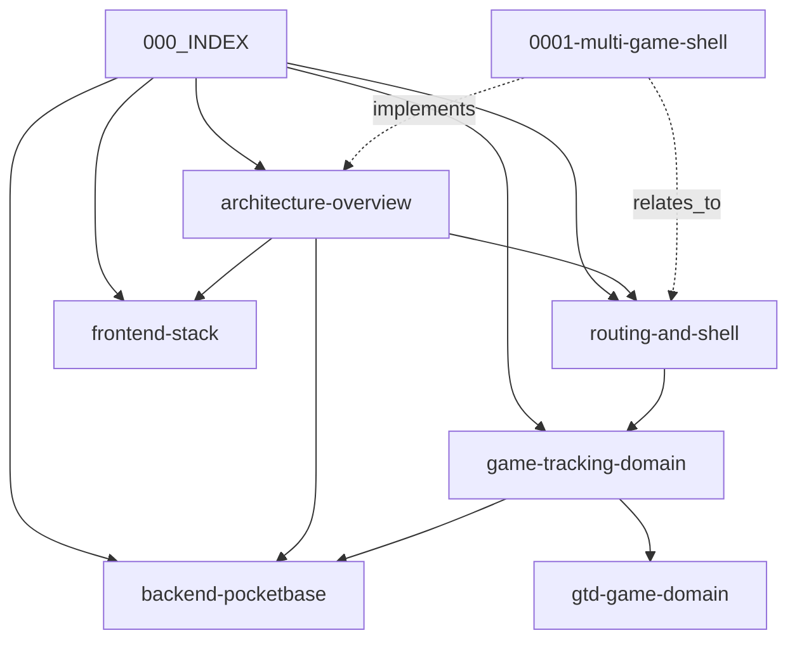

# 🕸️ Graphify Relationship Matrix

> **Graph Summary**: Complete node taxonomy and edge dependency matrix of the Kirayu Tracker Obsidian + Graphify memory network.

---

## 🟢 Node Inventory

| Node ID | Type | File Path | Primary Responsibility |
| :--- | :--- | :--- | :--- |
| `000_INDEX` | `moc` | [.memory/000_INDEX.md](file:///c:/Users/shink/Documents/kirayu-tracker/.memory/000_INDEX.md) | Central entry hub for memory graph |
| `architecture-overview` | `architecture` | [.memory/architecture/overview.md](file:///c:/Users/shink/Documents/kirayu-tracker/.memory/architecture/overview.md) | App gate & provider hierarchy |
| `routing-and-shell` | `architecture` | [.memory/architecture/routing-and-shell.md](file:///c:/Users/shink/Documents/kirayu-tracker/.memory/architecture/routing-and-shell.md) | Active route matching & theme engine |
| `frontend-stack` | `tech` | [.memory/tech_stack/frontend.md](file:///c:/Users/shink/Documents/kirayu-tracker/.memory/tech_stack/frontend.md) | React 19, Vite, Tailwind CSS v4 |
| `backend-pocketbase` | `tech` | [.memory/tech_stack/backend-pocketbase.md](file:///c:/Users/shink/Documents/kirayu-tracker/.memory/tech_stack/backend-pocketbase.md) | PocketBase authStore & APIs |
| `game-tracking-domain` | `domain` | [.memory/domains/game-tracking.md](file:///c:/Users/shink/Documents/kirayu-tracker/.memory/domains/game-tracking.md) | Multi-game tracking architecture |
| `gtd-game-domain` | `domain` | [.memory/domains/gtd-game.md](file:///c:/Users/shink/Documents/kirayu-tracker/.memory/domains/gtd-game.md) | Go Fishing 3D seed & status metrics |
| `0001-multi-game-shell` | `adr` | [.memory/decisions/0001-multi-game-shell.md](file:///c:/Users/shink/Documents/kirayu-tracker/.memory/decisions/0001-multi-game-shell.md) | Multi-game shell decision record |

---

## ⚡ Edge Relationship Graph

